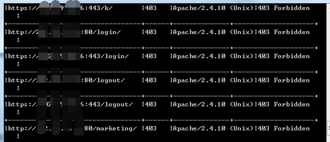

# 作者博客

http://www.tiaozhanziwo.com/

# 更新日志

<b>Httpscan Version：1.9（功能预告）</b>

解决内存负载的问题；

添加web探测的进度条模块，增强程序的人性化设计；

<b>Httpscan Version：1.8</b>

修复部分代码及功能函数；

根据端口特征过滤http请求，降低测试链接数量，提升效率；

<b>Httpscan Version：1.7</b>

添加针对已存在的web目录开展迭代查询，迭代次数由Iterations参数控制；

修复迭代过程中遇到的死循环问题，由Deduplicate列表控制；

功能模块函数化，精炼部分代码；

添加request前，先期判断http与https页面，测试链接数降低一半；

添加特定的404页面判定，增强程序的准确度；

解决301、302跳转的相关问题；

删除控制台的print输出，python的编码转换问题以及cmd的兼容问题真是太挫了，重新定义了logging函数，仍然没有很好的解决中文的输出问题，难道python2版本就真的没办法解决了吗？希望知道的小伙伴告诉我下！

利用爬虫的特性，分析、读取响应页面的URL，作为进一步web目录测试的条件；

<b>Httpscan Version：1.6</b>

修复针对域名列表的测试相关问题；

修复部分bug；

<b>Httpscan Version：1.5</b>

添加web页面测试时常见的漏洞目录等要素；

添加端口扫描模块，在测试的时候先进行端口扫描，然后针对指定端口开展web漏洞目录测试；

<b>Httpscan Version：1.4</b>

测试的时候发现对https的页面测试效果非常差，修复忽略https请求的证书验证等问题；

添加web页面测试时常见的漏洞端口等要素；

<b>Httpscan Version：1.3</b>

增加对多线程处理中的中断响应，（ctrl+c）实现柔和退出

<b>Httpscan Version：1.2</b>

增加https页面的访问功能，原来的版本https页面访问从日志信息中发现一直报错

<b>Httpscan Version：1.1</b>

增添日志输出功能，输出到程序目录的httpscan_log.txt文件中

<b>Httpscan Version：1.0</b>

代码是网上综合改造的

功能：基于web的信息探测，支持从文件读取目标（IP或域名），支持IP地址探测，IP地址支持CIDR，文件中的目标不加http(s)://，程序会自动添加

演示：

python xxx.py -f file.txt -t 20

python xxx.py 1.1.1.0/24 -t 20

# Install（安装需求库与程序）

1、pip install nmap

2、pip install python-nmap

3、pip install IPy

4、pip install lxml

5、系统需要安装nmap程序（下载安装：https://nmap.org/）

# To Do

有什么需求可以提交，我会着手改造！

#https页面的访问问题，目前有些问题，其实就是证书相关的东西；(<b>V-1.2版本已经解决</b>)

#增添对于访问目标后302跳转页面的输出以及日志记录功能；(<b>V-1.7版本已经解决</b>)

#添加对多线程处理中的中断响应（ctrl+c）；(<b>V-1.3版本已经解决</b>)

#测试的时候发现对https的页面测试效果非常不好，可能涉及到忽略证书等问题；(<b>V-1.4版本已经解决</b>)

#在进行页面的测试时，简单添加常见的漏洞目录、漏洞端口等要素；(<b>V-1.4版本初步构建功能</b>)

#收集了一个常见的网站目录，大概2000个，结合1.4版本构建的几千个常见web端口，完善一个测试策略。比如先进行一个端口扫描，再把开放的端口放入扫描队列，同时结合常见的漏洞目录列表进行，效率会有成倍的提升；(<b>V-1.5版本构建功能</b>)

#添加网站爬虫方法，不断提升网站目录漏洞扫描精准度，目前目录的遍历探测仅仅针对根目录，后续将实现对其他的二级、三级乃至多级目录的探测；(<b>V-1.7版本已经解决</b>)

#不断简化功能分类以及功能模组，提升代码的可读性以及代码分工的简易性；(<b>V-1.7版本初步解决</b>)

#目前的域名文件列表读取存在一些bug或者是问题，下一步着手解决；(<b>V-1.6版本已经解决</b>)

#扫描结果的优化处理：一是http的status为200，但是是一个特制的404页面，这种可以从title中做进一步判断；二是部分IP直接访问后，URL地址处会直接变成或者跳转到某个域名地址，结果可以把这一部分地址记录下来；(<b>V-1.7版本初步解决</b>)

#利用爬虫的特性，读取响应页面的URL，作为进一步web目录测试的条件，优化了目录探测的准确度，提升了web探测的精度；(<b>V-1.7版本初步解决</b>)

#portscan扫描模块有时候会卡住（一些可能的原因python-nmap库，多线程解决方案不完善等问题），下一步着手解决；

#根据特定的服务器响应信息，来进一步选择合适的测试payload，从而大量降低无效的链接请求；

#随着后期程序功能的不断扩充，替换部分效率低下的功能方法，去除不必要的接口、循环以及判断，提升程序的整体效率；

#鉴于C段扫描过程太长，后续可以添加一个扫描进度显示，然后界面就不显示扫描结果了，这个可以从端口扫描结束的时候开始显示，端口扫描结束的时候，后续的整体request数量就定了；

#添加域名解析、旁站解析、C段旁站解析；

#添加数据库存储功能，配合循环定时扫描，及时发现测试目标新的服务及功能；

# Q & A

<b>1、错误'ValueError: IP('1.1.1.1/24') has invalid prefix length (24)'的解决办法</b>

这个是由于IP地址的CIDR格式引起的，根据IPy的库规定，第一位必须是所在IP段的网络号，正确的写法如下：

1.1.1.0/24 : 1.1.1.0~1.1.1.255

1.1.1.128/25 : 1.1.1.128~1.1.1.255

1.1.1.64/26 : 1.1.1.64~1.1.1.127

1.1.1.32/27 : 1.1.1.32~1.1.1.63

1.1.1.16/28 : 1.1.1.16~1.1.1.31

<b>2、结果保存的相关问题</b>

结果除了显示在cmd的控制台界面外，还会在程序当前目录生成httpscan_log.txt文件，保存扫描的结果

<b>3、当遇到错误'module' object has no attribute 'PortScanner'时，尝试重新安装python-nmap</b>

pip uninstall python-nmap

pip install python-nmap

<b>4、nmap在vpn拨号情况下报错的处理办法</b>

当你拨vpn的情况下使用nmap，会出现如下问题

<pre><code>Starting Nmap 7.60 ( https://nmap.org ) at 2017-08-07 01:59 Pacific Daylight Time
Only ethernet devices can be used for raw scans on Windows, and
"ppp0" is not an ethernet device. Use the --unprivileged option
for this scan.
QUITTING!
</code></pre>

这个时候你可以打开port.txt，编辑如下：

<pre><code>-Pn -sV -p1-1024,7000-10000 --unprivileged
</code></pre>

